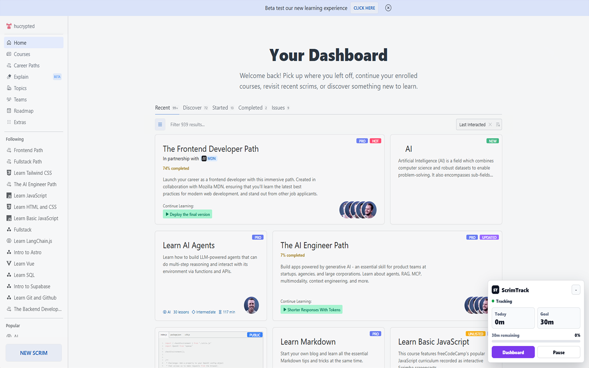
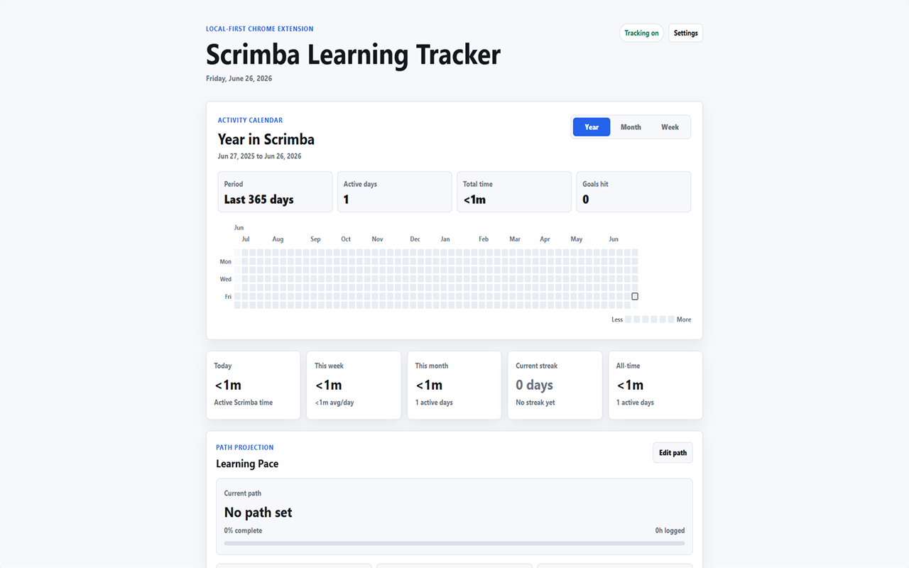
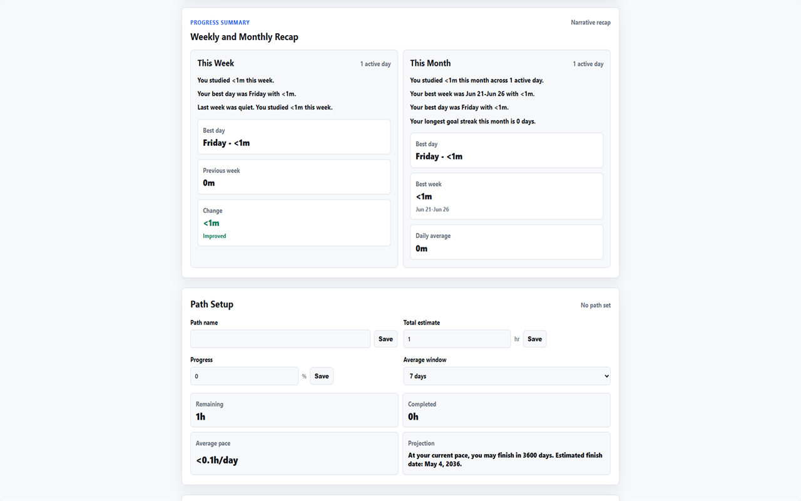
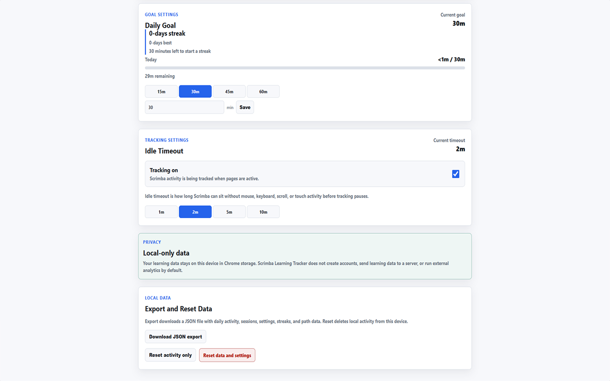

# ScrimTrack

ScrimTrack is an unofficial open-source Chrome extension for Scrimba learners.

It tracks your active learning time on Scrimba, shows daily/weekly/monthly progress, builds streaks, displays a GitHub-style learning heatmap, and estimates your finish date based on your pace.

## Install

Install ScrimTrack from the Chrome Web Store:

https://chromewebstore.google.com/detail/scrimtrack/akjmadgnfokenilllgienlgedemaaidh

## Screenshots

| Scrimba tracking popup | Activity dashboard |
| --- | --- |
|  |  |

| Progress and path setup | Settings and local data |
| --- | --- |
|  |  |

## Features

* Track active Scrimba learning time
* View daily, weekly, and monthly progress
* Build learning streaks
* See your activity in a GitHub-style heatmap
* Estimate your finish date based on your current pace
* Store learning data locally in your browser

## Roadmap

ScrimTrack is built milestone by milestone, with a focus on simple local-first tracking for Scrimba learners.

Planned improvements include:

* Refine active learning-time detection for Scrimba lessons
* Improve daily goal and streak visibility
* Add clearer weekly and monthly progress summaries
* Polish the contribution heatmap experience
* Improve manual path setup and finish-date projection
* Add local data export and reset controls
* Improve accessibility and extension UI polish

ScrimTrack will stay local-first and focused on Scrimba learning. Backend services, accounts, AI features, and social features are not part of the roadmap.

## Feedback and Contributions

Feedback, bug reports, and focused contributions are welcome.

Good issues or pull requests include:

* Bugs in Scrimba time tracking
* Incorrect daily, weekly, monthly, streak, or heatmap calculations
* UI or accessibility improvements
* Documentation fixes
* Small improvements that support the roadmap above

Before contributing:

* Keep the extension local-first.
* Track only `https://scrimba.com/*` and `https://v2.scrimba.com/*`.
* Keep Chrome permissions minimal.
* Avoid unrelated features, backend services, authentication, AI features, and social features.
* Run `npm run build` before opening a pull request.

## Privacy

ScrimTrack is privacy-friendly by default.

* Learning data stays on your device in `chrome.storage.local`.
* ScrimTrack does not require accounts or authentication.
* ScrimTrack does not send learning data to a backend server.
* External analytics are not enabled by default.
* ScrimTrack only tracks activity on supported Scrimba URLs.

## Permissions

ScrimTrack requests limited permissions:

* `storage` is used to save activity, sessions, streaks, settings, and path projection data locally.
* Scrimba host access is limited to:

  * `https://scrimba.com/*`
  * `https://v2.scrimba.com/*`

ScrimTrack does **not** request access to:

* browsing history
* tabs
* bookmarks
* cookies
* `webRequest`
* `browsingData`
* `<all_urls>`

## Disclaimer

ScrimTrack is an unofficial project and is not affiliated with, endorsed by, or sponsored by Scrimba.

## License

MIT
